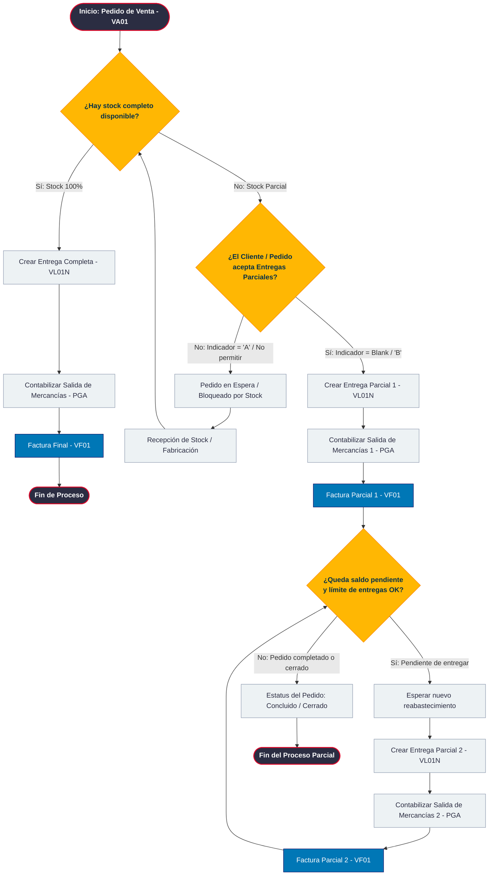

```mermaid
graph TD
    %% Estilos de Nodos
    classDef startFinish fill:#2b2d42,stroke:#d90429,stroke-width:2px,color:#fff,font-weight:bold;
    classDef process fill:#edf2f4,stroke:#8d99ae,stroke-width:1px,color:#2b2d42;
    classDef decision fill:#ffb703,stroke:#fb8500,stroke-width:1px,color:#023047,font-weight:bold;
    classDef sapDoc fill:#0077b6,stroke:#03045e,stroke-width:1px,color:#fff;

    Start([Inicio: Pedido de Venta - VA01]):::startFinish --> CheckStock{¿Hay stock completo disponible?}:::decision

    %% Flujo de Stock Completo
    CheckStock -->|Sí: Stock 100%| FullDeliv[Crear Entrega Completa - VL01N]:::process
    FullDeliv --> PostFull[Contabilizar Salida de Mercancías - PGA]:::process
    PostFull --> InvoiceFull[Factura Final - VF01]:::sapDoc
    InvoiceFull --> EndFull([Fin de Proceso]):::startFinish

    %% Flujo de Entrega Parcial
    CheckStock -->|No: Stock Parcial| PartialCheck{¿El Cliente / Pedido<br/>acepta Entregas Parciales?}:::decision
    
    PartialCheck -->|No: Indicador = 'A' / No permitir| Hold[Pedido en Espera / Bloqueado por Stock]:::process
    Hold --> WaitStock[Recepción de Stock / Fabricación]:::process
    WaitStock --> CheckStock

    PartialCheck -->|Sí: Indicador = Blank / 'B'| CreatePartial[Crear Entrega Parcial 1 - VL01N]:::process
    
    CreatePartial --> PGAPartial1[Contabilizar Salida de Mercancías 1 - PGA]:::process
    PGAPartial1 --> BillingPartial1[Factura Parcial 1 - VF01]:::sapDoc
    
    BillingPartial1 --> StatusCheck{¿Queda saldo pendiente<br/>y límite de entregas OK?}:::decision

    StatusCheck -->|Sí: Pendiente de entregar| Reproc[Esperar nuevo reabastecimiento]:::process
    Reproc --> CreatePartial2[Crear Entrega Parcial 2 - VL01N]:::process
    CreatePartial2 --> PGAPartial2[Contabilizar Salida de Mercancías 2 - PGA]:::process
    PGAPartial2 --> BillingPartial2[Factura Parcial 2 - VF01]:::sapDoc
    BillingPartial2 --> StatusCheck

    StatusCheck -->|No: Pedido completado o cerrado| CompleteDoc[Estatus del Pedido: Concluido / Cerrado]:::process
    CompleteDoc --> EndPartial([Fin del Proceso Parcial]):::startFinish
```
